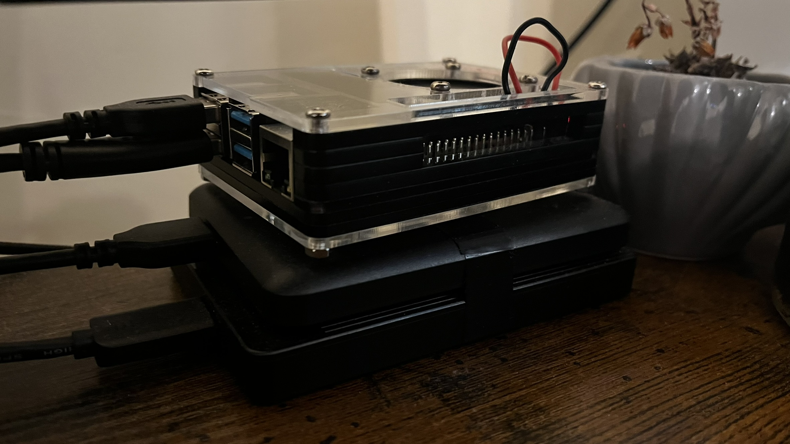
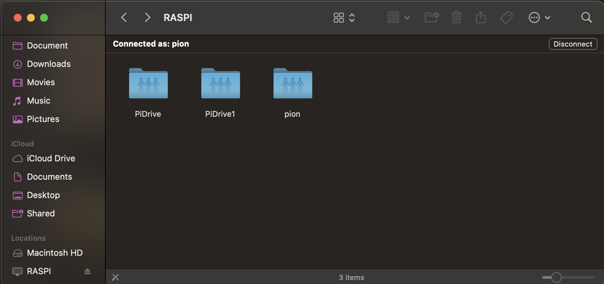

# 🍓 Raspberry Pi 4 Home NAS with Samba (Password-Protected)

This project turns your **Raspberry Pi 4 Model B** into a secure **home file server (NAS)** using **two external SSDs** and **Samba**, accessible across your Wi-Fi network from **Windows, macOS, or Linux** devices — all protected with a username and password.

---

## 📷 Setup Example (suggested images)

|  |  |
|---------------------------------------------|-----------------------------------------------|
| *Raspberry Pi with mounted SSDs*            | *Access via Finder on Mac using SMB*          |

---

## 📦 Requirements

- Raspberry Pi 4 Model B (Raspberry Pi OS installed)
- Two portable SSDs (formatted: exFAT, NTFS, or ext4)
- Power supply and USB ports for SSDs (use a powered USB hub if needed)
- Local home Wi-Fi or Ethernet network
- Monitor/keyboard or SSH access to your Pi

---

## 🛠️ Step-by-Step Setup

### 🔄 1. Update Your Raspberry Pi

```bash
sudo apt update && sudo apt upgrade -y

---

### 💽 Step 2: Connect and Mount SSDs

1. Plug in your SSDs
2. Check devices

```bash
lsblk

you will likely see:


